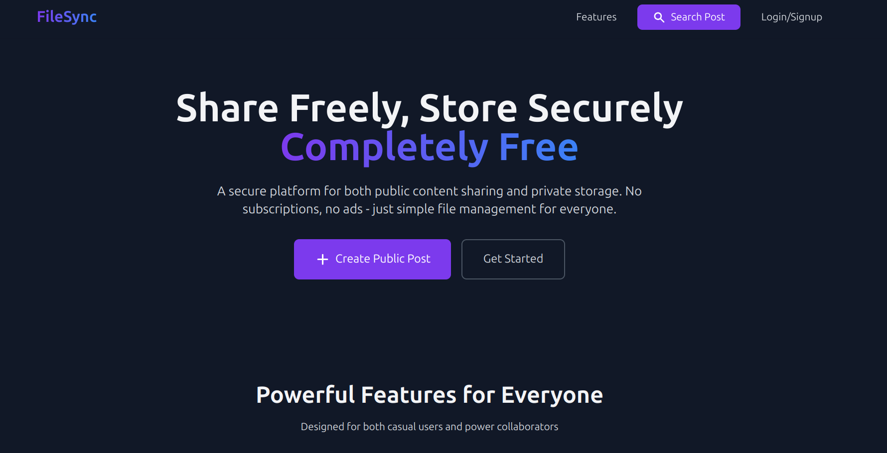
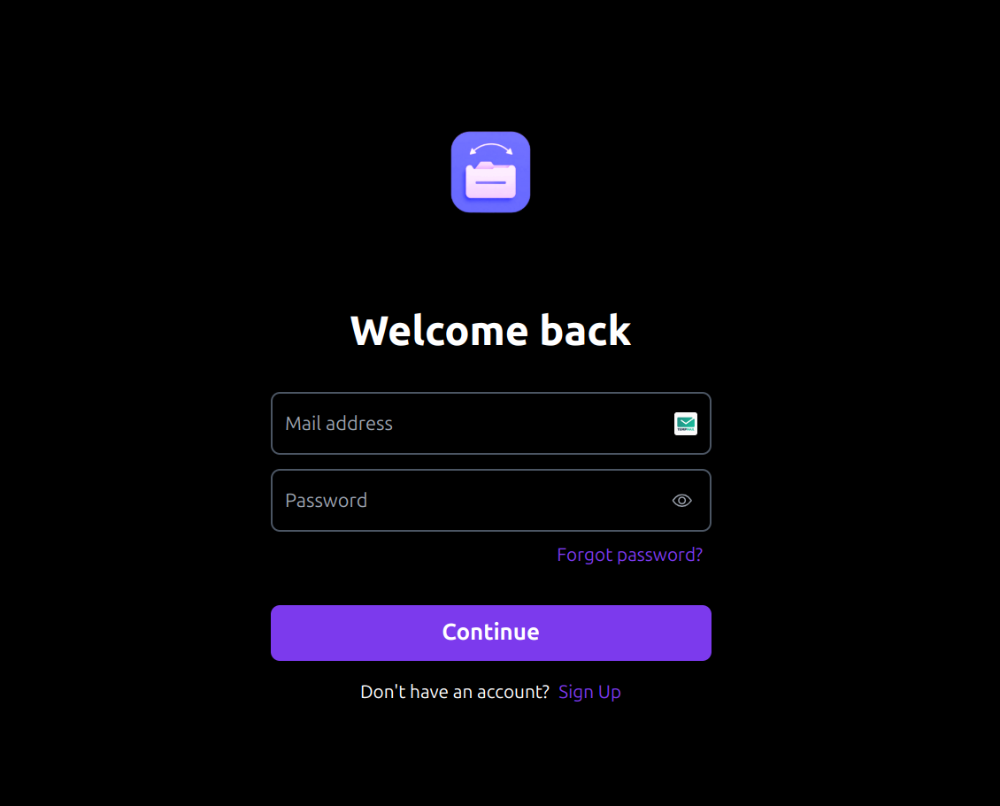
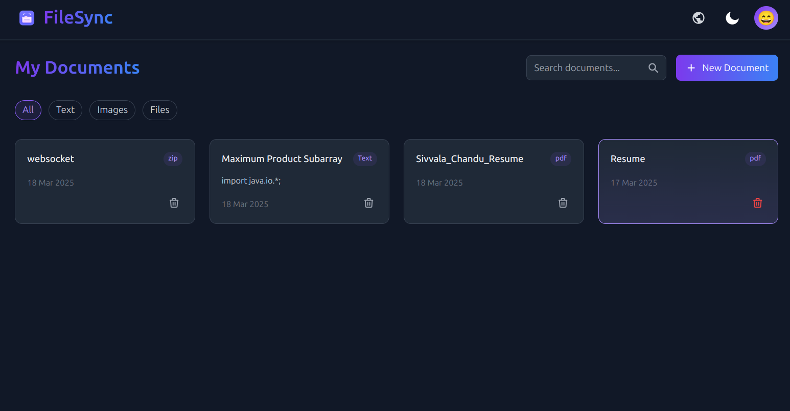
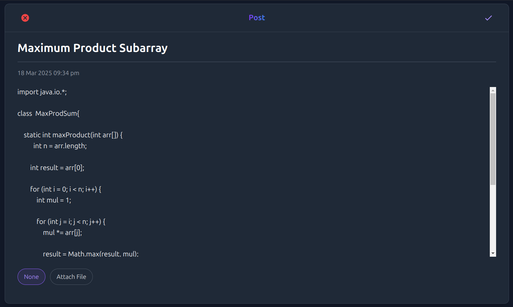
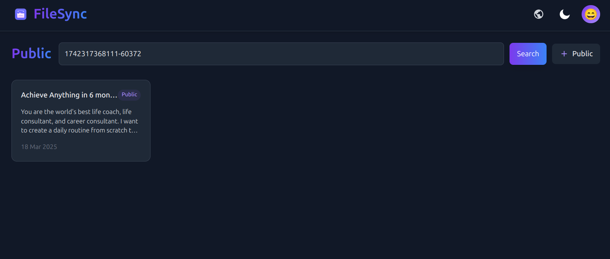
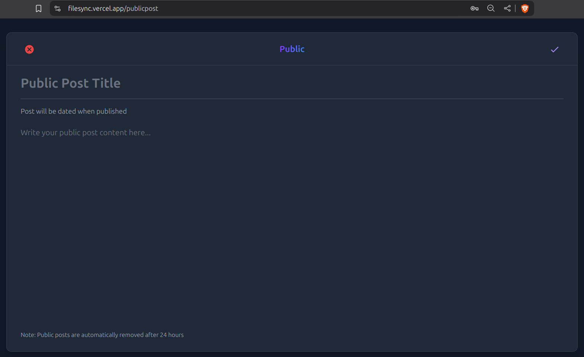

# FileSync

A secure platform for both public content sharing and private file storage. Share temporary public posts with auto-expiry, manage private files securely, and access content from anywhere.

  

## Features

- **Public Post Sharing**: Share content publicly with 24-hour auto-expiry
- **Secure Private Storage**: User-authenticated access to personal files
- **Instant Search**: Find public posts using unique IDs
- **Responsive Design**: Works seamlessly across all devices
- **Dark Mode**: Elegant dark theme by default
- **Modern UI**: Built with Tailwind CSS and React Icons
- **Public Post Preview**: Search and preview public posts before opening
- **New Tab Navigation**: Public posts open in separate tabs for better UX

## Personal

## Login Page

## HomeScreen

## Personal post

## Image preview

## Public

## Search post by ID

## Public post direct URL

## After successful post get ID

